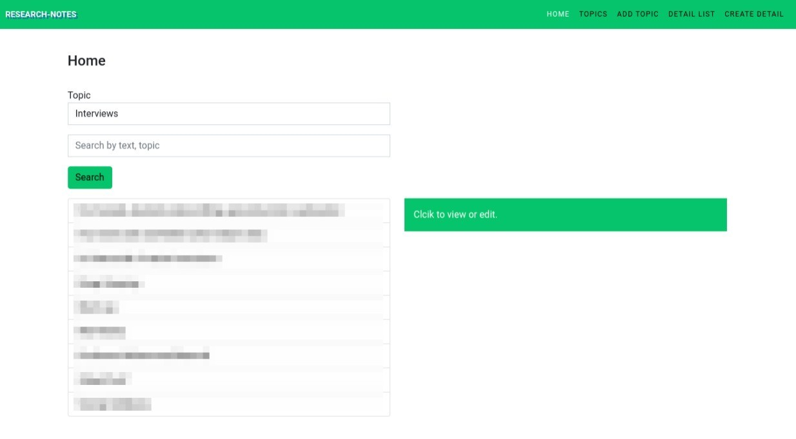

<div id="top"></div>

<!-- PROJECT LOGO -->
<br />
<div align="center">
  <a href="https://github.com/rpmcmurphy/research-notetaker.git">
    
  </a>

<h3 align="center">Research note-taking application built with Laravel and React.</h3>

  <p align="center">
    A project to help take notes on different topics and browse through later for convenience.
    <br />
  </p>
</div>

<!-- TABLE OF CONTENTS -->
<details>
  <summary>Table of Contents</summary>
  <ol>
    <li>
      <a href="#about-the-project">About The Project</a>
      <ul>
        <li><a href="#built-with">Built With</a></li>
      </ul>
    </li>
    <li>
      <a href="#getting-started">Getting Started</a>
      <ul>
        <li><a href="#prerequisites">Prerequisites</a></li>
        <li><a href="#installation">Installation</a></li>
      </ul>
    </li>
    <li><a href="#usage">Usage</a></li>
    <li><a href="#roadmap">Roadmap</a></li>
    <li><a href="#license">License</a></li>
    <li><a href="#contact">Contact</a></li>
  </ol>
</details>

<!-- ABOUT THE PROJECT -->

## About The Project



<p align="right">(<a href="#top">back to top</a>)</p>

### Built With

-   [Laravel](https://laravel.com/)
-   [React](https://reactjs.org)
-   [Bootstrap](https://getbootstrap.com)
-   [jQuery](https://jquery.com)
-   [MySQL](https://www.mysql.com)

<p align="right">(<a href="#top">back to top</a>)</p>

<!-- GETTING STARTED -->

## Getting Started

Like you install a Laravel application, clone the repo and get started with the instructions below.

PLEASE NOTE THAT THE APPLICATION HAS BOTH THE NORMAL WEB ROUTES WITH BLADE TEMPLATES AND THE API ROUTES WITH JSON RESPONSES, WHICH IS CONSUMED BY A FRONTEND REACT APP. THE WEB ROUTES ARE COMMENTED OUT. THE REACT VERSION IS LOCATED AT `resources/js/app-react.js`. AND IT'S GETTING APPENDED INTO THE BLADE FILE LOCATED AT `resources/views/react/index.blade.php`, WHICH IS THE INDEX PAGE FOR THE WEB APP, GETTING ROUTED FROM `routes/api.php`. THE NORMAL BLADE VERSION IS LOCATED AND CONFIGURED IN THE USUAL DIRECTORIES AND FILES AS PER LARAVEL CONVENTIONS.

### Prerequisites

You will need Laravel 8. Here are some of the things I have done in the project-

1. Used Laarvel Mix for the implementation of Sass and asset management
2. Customized Bootstrap to change the colos and other parts
3. Has conditional search implementation
4. Seelc2 for multi-select implementation
5. Eloquent relationship implementation
6. All the API endpoints implemented for React/Vue implementation

-   npm
    ```sh
    npm install npm@latest -g
    ```

### Installation

1. First clone this repository, install the dependencies, and setup your .env file.

2. Then create the necessary database.
    ```sh
    php artisan db
    create database research-details
    ```
3. And run the initial migrations and seeders.
    ```sh
    php artisan migrate
    ```
4. Install the necessary dependencies for Laarvel Mix
    ```sh
    npm install
    ```
5. Serve the application with- 
    ```sh
    php artisan serve
    ```

<p align="right">(<a href="#top">back to top</a>)</p>

<!-- USAGE EXAMPLES -->

## Usage

This application can be used to build a personal database on topics you add, plus the details on each topic. First, add TOPIC like interviews, personalities, articles etc. then add any number of DETAIL under each topic. That way you will be able to track/bookmark things and some details about it for later reference. It will serve as a bookmark for you, with unlimited number or amount of detail you want to save for later reference. Enjoy!

<p align="right">(<a href="#top">back to top</a>)</p>

<!-- ROADMAP -->

## Roadmap

-   [X] Implement API
-   [X] Replace the front-end with React
-   [X] Add option for multi-topic detail for more flexibility

See the [open issues](https://github.com/github_username/repo_name/issues) for a full list of proposed features (and known issues).

<p align="right">(<a href="#top">back to top</a>)</p>

<!-- LICENSE -->

## License

Distributed under the MIT License. See `LICENSE.txt` for more information.

<p align="right">(<a href="#top">back to top</a>)</p>

<!-- CONTACT -->

## Contact

[@ParbezRipon](https://twitter.com/ParbezRipon)

<p align="right">(<a href="#top">back to top</a>)</p>

<!-- MARKDOWN LINKS & IMAGES -->
<!-- https://www.markdownguide.org/basic-syntax/#reference-style-links -->

[contributors-shield]: https://img.shields.io/github/contributors/github_username/repo_name.svg?style=for-the-badge
[contributors-url]: https://github.com/github_username/repo_name/graphs/contributors
[forks-shield]: https://img.shields.io/github/forks/github_username/repo_name.svg?style=for-the-badge
[forks-url]: https://github.com/github_username/repo_name/network/members
[stars-shield]: https://img.shields.io/github/stars/github_username/repo_name.svg?style=for-the-badge
[stars-url]: https://github.com/github_username/repo_name/stargazers
[issues-shield]: https://img.shields.io/github/issues/github_username/repo_name.svg?style=for-the-badge
[issues-url]: https://github.com/github_username/repo_name/issues
